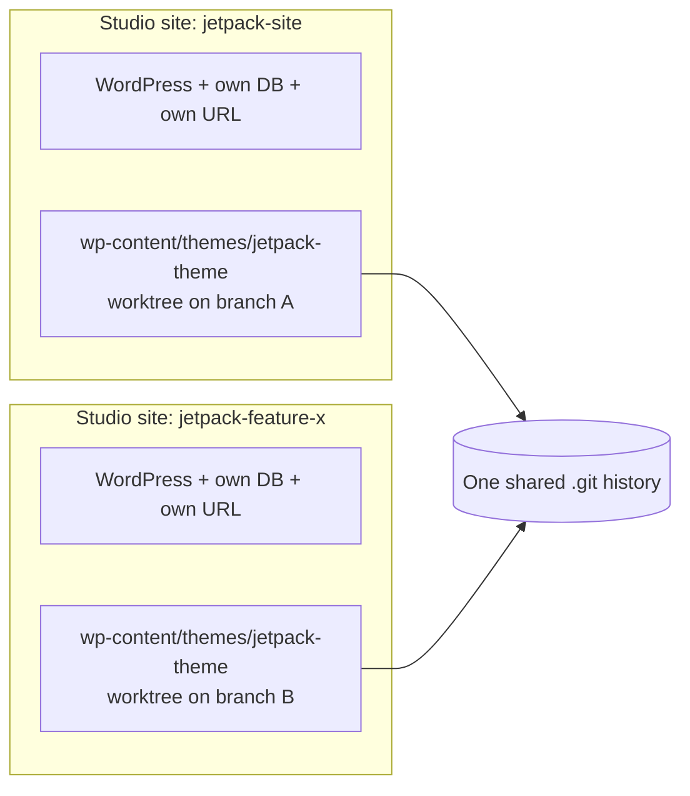

# Jetpack Theme

Block theme that powers the Jetpack marketing site. FSE / `theme.json`-driven with a small set of custom Gutenberg blocks for sections that need server-side logic.

This repository contains **only the theme**. The surrounding WordPress install is managed by [WordPress Studio](https://developer.wordpress.com/studio/) — see [Quick start](#quick-start-single-studio-site) below.

> **Future:** when this site needs custom plugins, the repo will be restructured to live at `wp-content/` instead of `wp-content/themes/jetpack-theme/`. See [Adding plugins (future)](#adding-plugins-future).

---

## Table of contents

1. [Prerequisites](#prerequisites)
2. [Quick start (single Studio site)](#quick-start-single-studio-site)
3. [Day-to-day commands](#day-to-day-commands)
4. [Working with branches (single site)](#working-with-branches-single-site)
5. [Advanced: parallel work with multiple Studio sites (worktrees)](#advanced-parallel-work-with-multiple-studio-sites-worktrees)
6. [Editor setup — Cursor](#editor-setup--cursor)
7. [Editor setup — Claude Code](#editor-setup--claude-code)
8. [Studio quirks (read this)](#studio-quirks-read-this)
9. [FSE / block-theme philosophy](#fse--block-theme-philosophy)
10. [Adding plugins (future)](#adding-plugins-future)
11. [Troubleshooting](#troubleshooting)
12. [Contributing](#contributing)

---

## Prerequisites


| Tool                                                        | Why                                                                                                                                                                   | Install                                                                                      |
| ----------------------------------------------------------- | --------------------------------------------------------------------------------------------------------------------------------------------------------------------- | -------------------------------------------------------------------------------------------- |
| [WordPress Studio](https://developer.wordpress.com/studio/) | Local WordPress (PHP WASM + SQLite)                                                                                                                                   | [Download](https://developer.wordpress.com/studio/)                                          |
| Studio CLI                                                  | `studio wp` commands in your terminal                                                                                                                                 | Studio app -> Settings -> "Studio CLI for terminal" -> toggle on, then open a fresh terminal |
| Node.js 20+                                                 | Build tooling (`wp-scripts`, Tailwind 4)                                                                                                                              | [nodejs.org](https://nodejs.org/) or `nvm install 20`                                        |
| [bun](https://bun.sh/)                                      | Package manager. `bun.lockb` is the **committed lockfile**; `package-lock.json` is gitignored. npm works as a fallback but bun is the canonical choice for this repo. | `curl -fsSL https://bun.sh/install | bash`                                                   |
| Git 2.5+                                                    | `git worktree` requires 2.5; we use 2.40+ features                                                                                                                    | bundled on macOS, `brew install git` to upgrade                                              |


---

## Quick start (single Studio site)

This is the **common path**. Most contributors only ever need this.

```bash
# 1. Create a Studio site named "jetpack-site" via the Studio app.
#    Studio scaffolds it at ~/Studio/jetpack-site/.

# 2. Replace the auto-downloaded theme with this repo.
rm -rf ~/Studio/jetpack-site/wp-content/themes/jetpack-theme
git clone https://github.com/DevinWalker/jetpack-website-2026.git \
  ~/Studio/jetpack-site/wp-content/themes/jetpack-theme

# 3. Install deps and build.
cd ~/Studio/jetpack-site/wp-content/themes/jetpack-theme
bun install        # or: npm install
bun run build      # or: npm run build

# 4. Activate the theme.
studio wp theme activate jetpack-theme
#  (or via WP admin: Appearance -> Themes -> "Jetpack Theme")

# 5. Open the site.
studio site status   # shows the dynamic localhost URL
```

That's it. Day-to-day work happens in `wp-content/themes/jetpack-theme/`.

---

## Day-to-day commands

Run from the theme directory. Examples use `bun` (canonical); swap `bun` for `npm` if you prefer — both work because the scripts in `[package.json](package.json)` just shell out to `wp-scripts`.


| Command              | What it does                                                                                                                                                     |
| -------------------- | ---------------------------------------------------------------------------------------------------------------------------------------------------------------- |
| `bun run start`      | Webpack watch + browser-sync. Auto-reloads on save. Auto-detects the Studio port.                                                                                |
| `bun run build`      | Production build into `build/` (gitignored).                                                                                                                     |
| `bun run lint:js`    | ESLint via `@wordpress/scripts`.                                                                                                                                 |
| `bun run lint:style` | stylelint via `@wordpress/scripts`.                                                                                                                              |
| `bun run typecheck`  | `tsc --noEmit`. Catches typos in Interactivity API `state.*` / `actions.*` / `context.*` bindings before runtime.                                                |
| `bun run format`     | Prettier via `@wordpress/scripts`.                                                                                                                               |
| `studio wp ...`      | Any WP-CLI command (e.g., `studio wp cache flush`, `studio wp option get siteurl`). Always prefix with `studio` — see [Studio quirks](#studio-quirks-read-this). |


> **Lockfile rule:** commit changes to `bun.lockb` when you change dependencies. Don't commit a `package-lock.json` — it's in `.gitignore`. If you only have npm available locally, that's fine; just don't accidentally remove `bun.lockb` from the repo.

### Source language: TypeScript

Block source files in [`src/`](src/) are written in **TypeScript** (`.tsx` for React components, `.ts` for non-component modules like Interactivity API stores). Configuration is in [`tsconfig.json`](tsconfig.json); `typescript` + `@types/react` + `@types/react-dom` are in `devDependencies`.

**Why TypeScript here, specifically:** this theme uses the [WordPress Interactivity API](https://developer.wordpress.org/block-editor/reference-guides/interactivity-api/) for several custom blocks (`site-header`, `testimonials`, `faq`, `hero`, `blur-headline`). The Interactivity API binds DOM attributes to JavaScript identifiers via strings like `data-wp-on--click="actions.openMenu"` and `data-wp-bind--aria-expanded="state.openMenu === context.menuId"` — type-safe `state` / `actions` / `context` definitions catch typos in those strings (and matching renames across files) at compile time, where JavaScript would silently fail at runtime.

This is also the **WordPress core team's recommended approach** for Interactivity API blocks. See the official [Using TypeScript with the Interactivity API](https://github.com/wordpress/gutenberg/blob/trunk/docs/reference-guides/interactivity-api/core-concepts/using-typescript.md) guide and the `@wordpress/create-block-interactive-template` scaffolder, which ships with TypeScript by default.

**Conventions for new code:**

- New custom blocks that use the Interactivity API: write `view.tsx` + `store.ts` in TypeScript, modeled on [`src/blocks/site-header/store.ts`](src/blocks/site-header/store.ts) — define an explicit `interface XState`, pass it to `store<XState>(...)`, and use `getContext< { ... } >()` for typed context.
- New blocks that don't touch the Interactivity API: TypeScript still preferred for consistency, but plain `.jsx` / `.js` is acceptable if the block is genuinely simple (static markup, no client-side state).
- Run `bun run typecheck` before pushing if you touched any `.ts` / `.tsx` file.

---

## Working with branches (single site)

```bash
git fetch origin
git switch -c feat/my-feature origin/main   # or just: git switch <existing-branch>
# ... edit ...
bun run build       # if you changed any block source / CSS / JS
git add -p && git commit -m "feat: something"
git push -u origin feat/my-feature
```

Switching branches in a single working directory is the simplest workflow. **You only need worktrees if you want two branches running in two browsers at the same time** — see next section.

---

## Advanced: parallel work with multiple Studio sites (worktrees)

When to use this:

- Reviewing a PR while building another feature
- A/B comparing two design directions in real browsers
- Demoing a stable branch to a teammate while you work on the next thing

A WordPress site can only have one version of a theme active at a time, so two browser windows = two Studio sites. Each Studio site has its own database (so each can have different posts / nav menus / pages — useful for browser-sync testing different content).

**A `git worktree` lets two folders share one git history**, so you don't end up with two separately-cloned repos drifting apart.




### Setting up a second site

```bash
# 1. In the Studio app, create a new site named e.g. "jetpack-feature-x".
#    Studio scaffolds it at ~/Studio/jetpack-feature-x/.

# 2. Remove the auto-scaffolded theme.
rm -rf ~/Studio/jetpack-feature-x/wp-content/themes/jetpack-theme

# 3. Add a worktree from the *original* clone, on the branch you want.
cd ~/Studio/jetpack-site/wp-content/themes/jetpack-theme
git fetch origin
git worktree add \
  ~/Studio/jetpack-feature-x/wp-content/themes/jetpack-theme \
  feat/whatever-branch

# 4. Install deps + build for this worktree (each worktree has its own
#    node_modules and build output — they are gitignored).
cd ~/Studio/jetpack-feature-x/wp-content/themes/jetpack-theme
bun install
bun run build

# 5. Activate in the new site.
studio wp --path=~/Studio/jetpack-feature-x theme activate jetpack-theme
```

### Daily worktree maintenance

```bash
# See all worktrees attached to this repo.
git worktree list

# `git fetch` from any worktree updates the shared remote-tracking branches —
# you only need to fetch once across all worktrees.
git fetch origin

# Remove a worktree when you're done.
git worktree remove ~/Studio/jetpack-feature-x/wp-content/themes/jetpack-theme
```

### Constraints to know

- Git refuses to check out the same branch in two worktrees simultaneously. This is a feature, not a bug — it prevents you from accidentally committing in two places. Use one worktree per branch.
- Each worktree needs its own `bun install` and `bun run build` (because `node_modules/` and `build/` are gitignored).
- Don't `git clone` the repo a second time when you want a second site. Use `git worktree add` instead — that's the whole point.

---

## Editor setup — Cursor

Cursor (like VSCode) only scans **one folder deep** for git repositories by default. This repo lives at `wp-content/themes/jetpack-theme/` — that's four levels deep from the Studio site root, so Cursor's Source Control panel won't detect it without help.

### Option A: multi-root workspace (recommended for multi-site dev)

Create a `.code-workspace` file **outside any of your Studio sites** (e.g., at `~/Studio/jetpack-site.code-workspace`). Don't commit it to this repo — paths are user-specific.

```json
{
  "folders": [
    { "name": "jetpack-site (WordPress)",       "path": "jetpack-site" },
    { "name": "jetpack-theme [git]",           "path": "jetpack-site/wp-content/themes/jetpack-theme" },
    { "name": "jetpack-feature-x (WP)",    "path": "jetpack-feature-x" },
    { "name": "jetpack-theme [feature-x git]", "path": "jetpack-feature-x/wp-content/themes/jetpack-theme" }
  ],
  "settings": {
    "git.repositoryScanMaxDepth": 5,
    "git.detectSubmodules": false,
    "files.exclude": { "**/.DS_Store": true }
  }
}
```

Open it via **File -> Open Workspace from File...**. Source Control panel will then show one entry per worktree on its current branch.

### Option B: single workspace + bumped scan depth

If you only ever open the WordPress site root in Cursor, add to your User or Workspace settings:

```json
{ "git.repositoryScanMaxDepth": 5 }
```

Then Cursor will find the nested git repo without needing it as an explicit root.

### Cursor rules

This repo ships rules at `[.cursor/rules/](.cursor/rules/)` — Cursor reads them automatically. They cover the FSE-first philosophy, WordPress core block attribute gotchas, etc.

---

## Editor setup — Claude Code

Claude Code reads `[AGENTS.md](AGENTS.md)` and `[CLAUDE.md](CLAUDE.md)` automatically — no special config needed. Recommended workflow:

- **One Claude Code session per worktree.** Open Claude Code in the theme folder of whichever Studio site you're working on. Claude sees that worktree's branch and only that branch's files.
- **Worktree commands work normally.** `git switch`, `git fetch`, `git worktree add` all behave the same as in any git repo.
- **Skills available:** see `[.claude/skills/](.claude/skills/)` (in the Studio site root, not this repo) and `[.cursor/rules/](.cursor/rules/)` — both Cursor and Claude Code can use them.

---

## Studio quirks (read this)

Studio runs WordPress on PHP WASM with SQLite, not Apache + MySQL. A few things differ from a stock LAMP stack — these are the ones that bite contributors.

**Three Markdown files Studio scaffolds at every site root** (one level above this theme — they live in the Studio site, not in this repo, because they describe the surrounding WordPress install):

- `<site-root>/STUDIO.md` — the substantive guide. Covers SQLite vs MySQL, dynamic ports, `wp-config.php` quirks, debug logging, mu-plugins, and more. **Read this.**
- `<site-root>/AGENTS.md` — short pointer for AI agents (redirects to `STUDIO.md`).
- `<site-root>/CLAUDE.md` — Claude-specific pointer (just `@AGENTS.md`).

Highlights to internalize:


| Rule                                                                                     | Why                                                                                                                                         |
| ---------------------------------------------------------------------------------------- | ------------------------------------------------------------------------------------------------------------------------------------------- |
| Always prefix `wp` with `studio` (e.g., `studio wp option get siteurl`)                  | Studio runs WordPress in PHP WASM. A standalone `wp` binary will not work.                                                                  |
| Use `studio wp eval`, not `wp shell`                                                     | `wp shell` is unsupported in PHP WASM.                                                                                                      |
| Never reference `DB_NAME`, `DB_HOST`, `DB_USER`, `DB_PASSWORD`                           | They're undefined. SQLite handles persistence via the `wp-content/db.php` drop-in.                                                          |
| Don't delete `wp-content/db.php` or `wp-content/mu-plugins/sqlite-database-integration/` | Required for the database to work.                                                                                                          |
| Never edit `wp-includes/` or `wp-admin/`                                                 | Studio runs on PHP WASM; core changes don't persist as expected. Use hooks, child themes, or this theme.                                    |
| Get the URL from `studio site status`                                                    | Ports are assigned dynamically per session. Never hardcode them — see [Troubleshooting](#troubleshooting) for what we do about stored URLs. |


---

## FSE / block-theme philosophy

This is a block theme. **Work with WordPress, not against it.** Mirror of `[.cursor/rules/fse-philosophy.mdc](.cursor/rules/fse-philosophy.mdc)` so non-Cursor devs see it too.

### Prefer in this order

1. **Core blocks** — `wp:query`, `wp:post-template`, `wp:post-featured-image`, `wp:post-title`, `wp:post-excerpt`, `wp:template-part`.
2. **HTML template parts** — files in `[parts/](parts/)` included via `<!-- wp:template-part {"slug":"x"} /-->`.
3. `**wp:group` wrappers in templates** — add structural divs for layout when the default flat DOM from `wp:post-template` doesn't have a content column to hang CSS on.
4. **Custom block** — only when attributes/logic can't be expressed via core blocks (e.g., sticky-first ordering with backfill, server-side options access, the `[site-header](blocks/site-header/)` Interactivity-API menu).

### Anti-patterns

- `get_template_part('parts/blog/...')` in templates — classic-theme pattern, not FSE.
- Copying `parts/blog/*.php` from a classic theme into a block theme — port to core blocks instead.
- Creating a custom block just to add a wrapper div — add `<!-- wp:group {"className":"..."} -->` in the template.

### Template routing gotcha

`page_for_posts = N` makes that page render `templates/index.html` (blog index), **not** the page's block content. Edit `templates/index.html` to change the blog-index layout.

After registering a new taxonomy in `functions.php`, flush rewrite rules once (visit `/wp-admin/options-permalink.php` or run `studio wp rewrite flush`) or topic archives 404.

---

## Adding plugins (future)

This repo is theme-only today. When the site needs custom plugins (e.g., a marketing-utils plugin or migration scripts), we will **restructure the repo to live at `wp-content/`** so theme + plugins ship together.

### Why one repo, not many

Per Studio's [official guidance](https://developer.wordpress.com/docs/developer-tools/github-deployments/create-repo-existing-source), both patterns are valid: one repo at `wp-content/` OR one repo per theme/plugin. We're choosing the **single-repo / `wp-content/` pattern** because:

- It mirrors the `[Automattic/jetpack` monorepo](https://github.com/Automattic/jetpack), which is the canonical Automattic precedent.
- Theme + plugin can ship in atomic PRs (e.g., a CPT registered by a plugin and rendered by a theme template).
- One worktree gets a contributor every piece of custom code at once.
- Single CI pipeline.

### Target structure

```
wp-content/
├── themes/
│   └── jetpack-theme/                ← this theme, after migration
└── plugins/
    └── jetpack-marketing-utils/      ← example custom plugin
```

### What to track in `.gitignore` after migration

Whitelist style — ignore everything in `themes/` and `plugins/` then re-include only the custom ones:

```gitignore
# WordPress core, uploads, cache (managed by Studio, not us)
/*
!/themes/
!/plugins/

# Default themes Studio downloads — not ours
themes/*
!themes/jetpack-theme/

# Third-party plugins (akismet, jetpack-the-plugin, etc.) — not ours
plugins/*
!plugins/jetpack-marketing-utils/
# Add more `!plugins/<name>/` lines as plugins are added.

# Studio infrastructure
mu-plugins/sqlite-database-integration/
uploads/
cache/
upgrade/
database/
```

### When to migrate

The day plugin #1 is needed. Don't preemptively restructure — the migration is easier when paired with a real feature and there are fewer in-flight branches to update.

### Migration runbook (when the time comes)

```bash
# 1. From a fresh clone of the theme repo.
git clone https://github.com/DevinWalker/jetpack-website-2026.git temp-migrate
cd temp-migrate

# 2. Use git filter-repo to move everything into themes/jetpack-theme/
#    (preserving full history including blame and tags).
#    Install: brew install git-filter-repo
git filter-repo --to-subdirectory-filter themes/jetpack-theme

# 3. Add the new plugin alongside.
mkdir -p plugins/jetpack-marketing-utils

# 4. Update .gitignore (see above).

# 5. Force-push to a new branch (or coordinate a force-push to main).
#    All collaborators must re-clone or git reset --hard.
git push --force origin main

# 6. Update every active worktree to the new path layout.
#    Every Studio site's theme folder must move from
#      <site>/wp-content/themes/jetpack-theme/
#    to a worktree of the new wp-content/-rooted repo, e.g.:
#      <site>/wp-content/  (entire wp-content as the worktree root)
```

Coordinate with anyone with branches in flight — branches created before the migration will need rebasing onto the new structure, since file paths change.

### Why not separate repos per plugin

- Cross-repo PRs for atomic theme+plugin changes are painful.
- More repos = more CI configs, more `.gitignore`s, more onboarding overhead.
- No precedent inside Automattic for marketing sites of this size.

---

## Troubleshooting


| Symptom                                                              | Fix                                                                                                                                                                                                                                                                                                                                                                                                                                                    |
| -------------------------------------------------------------------- | ------------------------------------------------------------------------------------------------------------------------------------------------------------------------------------------------------------------------------------------------------------------------------------------------------------------------------------------------------------------------------------------------------------------------------------------------------ |
| **Cursor doesn't see git in the theme**                              | Add the theme folder as an explicit workspace root, OR set `"git.repositoryScanMaxDepth": 5` in workspace settings. See [Editor setup — Cursor](#editor-setup--cursor).                                                                                                                                                                                                                                                                                |
| `**git worktree add` fails with "already checked out"**              | The branch is checked out in another worktree. Run `git worktree list` to find it. Either work in that worktree or check out a different branch in the new one.                                                                                                                                                                                                                                                                                        |
| **Topic / taxonomy archives 404 after a `register_taxonomy` change** | Flush rewrite rules: visit `/wp-admin/options-permalink.php` once, or run `studio wp rewrite flush`.                                                                                                                                                                                                                                                                                                                                                   |
| **browser-sync hits the wrong port / "Cannot proxy"**                | Handled by the auto-detect logic in `[webpack.config.js](webpack.config.js)` (added in `feat/synced-pricing-pattern`). Re-run `bun run start`. If it still fails, run `studio site status` and confirm the port matches what Studio reports.                                                                                                                                                                                                           |
| **Header nav links go to a stale `localhost:8881` (wrong port)**     | The custom links in the "Main Jetpack Header" menu are stored as absolute URLs in the database. The theme normalizes them at render time via `jetpack_normalize_local_url()` in `[functions.php](functions.php)` — host-scoped, so external links pass through. If you see stale URLs in the menu admin UI itself, optionally clean stored data: `studio wp search-replace 'http://localhost:OLD_PORT' "$(studio wp option get siteurl)" wp_postmeta`. |
| `**studio: command not found`**                                      | Open Studio app -> Settings -> "Studio CLI for terminal" -> toggle on, then open a fresh terminal.                                                                                                                                                                                                                                                                                                                                                     |
| **PHP errors not visible**                                           | `studio site set --debug-log --debug-display`, then check `wp-content/debug.log`.                                                                                                                                                                                                                                                                                                                                                                      |
| **Site won't start after a config change**                           | `studio site stop && studio site start --skip-browser`.                                                                                                                                                                                                                                                                                                                                                                                                |


---

## Contributing

1. Branch from `main`: `git switch -c feat/short-description origin/main`.
2. Use [conventional commits](https://www.conventionalcommits.org/): `feat:`, `fix:`, `refactor:`, `docs:`, `chore:`.
3. Run `bun run lint:js && bun run lint:style && bun run typecheck` before pushing.
4. Open a PR against `main`. Reference the related Linear issue if there is one.

For larger architectural changes, draft a short plan in the PR description before implementation. Atomic, focused PRs are easier to review than sprawling ones.